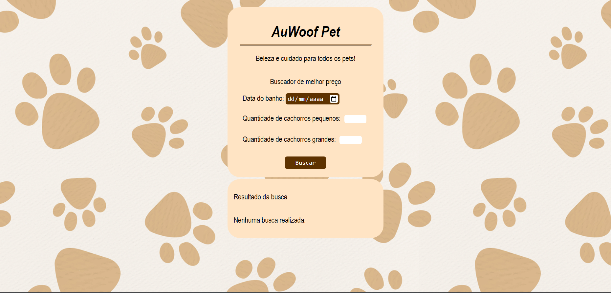
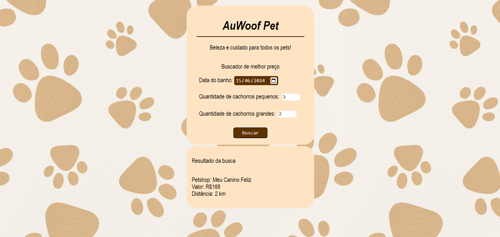

# 🐾 AuWoof Pet App

## ✍️ Introdução
O AuWoof Pet App foi desenvolvido para facilitar a expeciência do usuário ao verificar os preços de banho em PetShop's cadastrados no sistema.
O aplicativo fornece, com base na quantidade de cães pesquenos e grandes, e com a data que se deseja o serviço, o melhor PetShop baseando-se no menor preço e distância do usuário.

## 📝 Decisões de Projeto
Na realização do projeto foi utilizado o Node.js em conjunto com o Express para criação de uma API que retorna a resposta com a informações ao usuário. O Front foi desenvolvido utilizando HTML, CSS e JavaScript.

## 🛠️ Tecnologias 
* JavaScript;
* HTML;
* CSS;
* Node.js;
* Express;

## 🖊️ Lista de premissas assumidas
O programa recolhe as informações de quantidade de cães e data informada.
Com base nisso é feita a análise de qual o melhor PetShop levando em consideração em primeiro lugar o menos preço de serviço oferecido.
Em caso de preços iguais o programa verifica o PetShop com a menor distância em relação ao cliente.

Considera-se que os dados serão informados de maneira corretamente, sendo eles a quantidade de cães maior ou igual a 0 e a data informada.

Caso não sejam informados os valores de data o programa assume a data atual e caso não seja informado a quantidade de cães o programa assume o valor 0.

Não foi possível validar o caso de uso de quantidade de cães quando negativo, retornando assim uma resposta incorreta caso sejam inseridos esses valores.

## 💻 Como Executar
É necessário ter o Node.js instalado na máquina.
Para executar utilize os seguintes comandos:

`npm install`

`node server.js`.

## 🖼️ Visão Geral
Tela geral antes de realizar pesquisa:

Tela após realização da busca:

